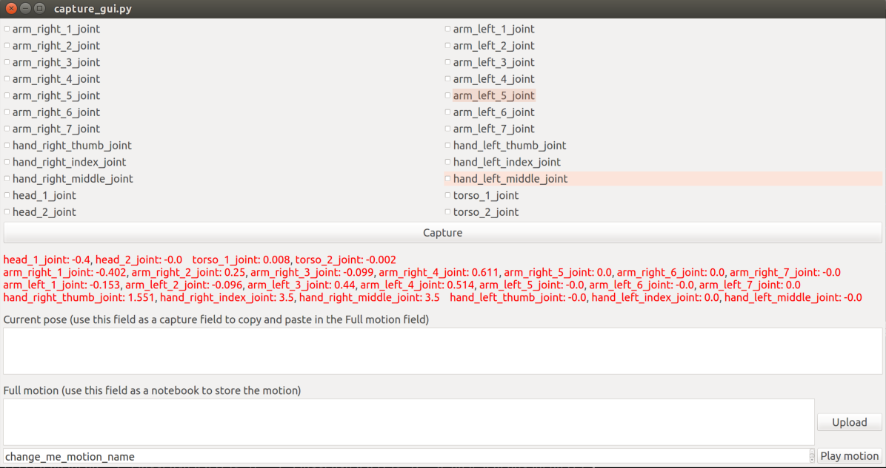
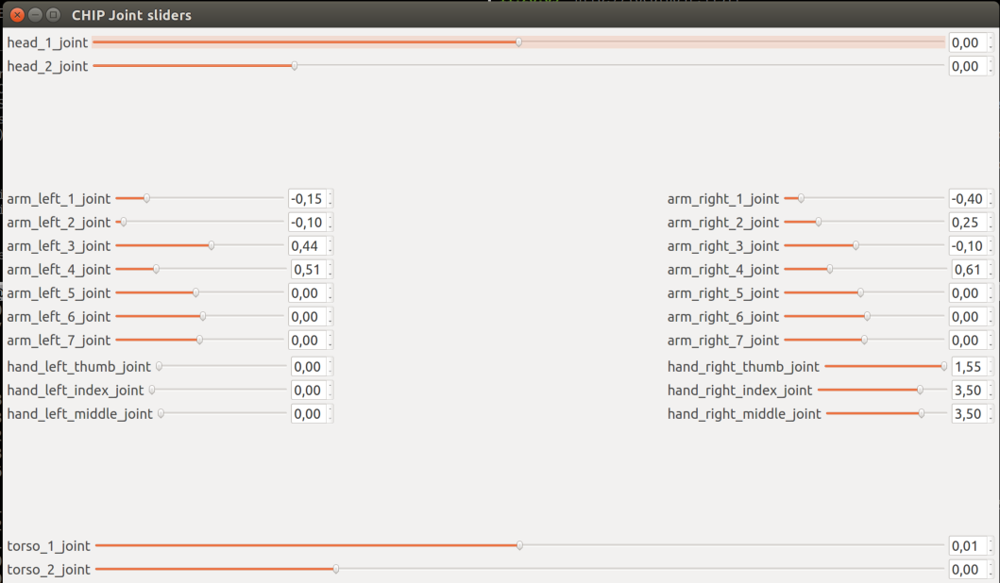

# REEM movements creator

Tools to create new play_motion motions.





# Workflow

The following instructions are related to CBA Innovation lab REEM (CHIP), but should apply on any REEM.

## Create a workspace for the package

```bash
mkdir movements_ws
cd movements_ws
mkdir src
cd src
catkin_init_workspace
git clone https://github.com/pal-robotics/reem_movements_creator
cd ..
catkin_make
source devel/setup.bash
```

## Open two terminals and source the workspace

```bash
source ~/movements_ws/devel/setup.bash
```

## To make sure the robot can communicate with your machine

Check your IP from the network.

```bash
ifconfig

wlan0     Link encap:Ethernet  HWaddr 00:15:00:e8:fc:83  
          inet addr:10.68.0.111  Bcast:10.68.0.127  Mask:255.255.255.128
          inet6 addr: fe80::215:ff:fee8:fc83/64 Scope:Link
          UP BROADCAST RUNNING MULTICAST  MTU:1500  Metric:1
          RX packets:25693 errors:0 dropped:0 overruns:0 frame:0
          TX packets:22917 errors:0 dropped:0 overruns:0 carrier:0
          collisions:0 txqueuelen:1000 
          RX bytes:22317366 (22.3 MB)  TX bytes:3218074 (3.2 MB)
```

And settle your `ROS_IP` variable:

```bash
export ROS_IP=10.68.0.111
``` 

## Move joints with sliders

To move the joints of the robot run:

    rosrun reem_movements_creator joints_sliders.py

## Capture poses in play_motion format

Run:

    rosrun reem_movements_creator capture_gui.py

You need to check the joints you are interested in learning for the motion previous to capture them.

Currently you need to choose a full group (all head joints, or all hand joints, or all arm joints or all torso joints) for that group of joints to move. This is being worked on so it is not necessary.

You click on capture and it will generate the play_motion yaml config for the motion.

You can upload the current motion and play it with the corresponding buttons.

Be careful and put big `time_from_start` times when trying.

### How to store your motion for future use

Just copy and paste the full motion you tried into a text file and call it your_motion_name.yaml

Put in the robot in reemh3-3c:~/new_motions folder
Add to `user_software_start.sh` the loading of the motion at boot with a line like:

    rosparam load ~/new_motions/fist_bump.yaml

From now on you can access the motion via the usual play_motion ways (tablet, web interface, PyREEM...)

# How to use less bandwith

Run on the robot:

```bash
ssh pal@reemh3-3c
rosrun topic_tools throttle messages /joint_states 5 /joint_states_throttled
```

And run in your machine the commands remapping the `/joint_states` topic like this:

```bash
rosrun reem_movements_creator joints_sliders.py /joint_states:=/joint_states_throttled
```

```bash
rosrun reem_movements_creator capture_gui.py /joint_states:=/joint_states_throttled
```